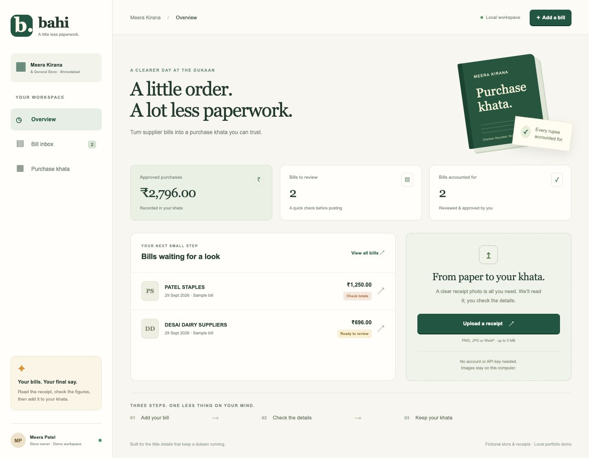
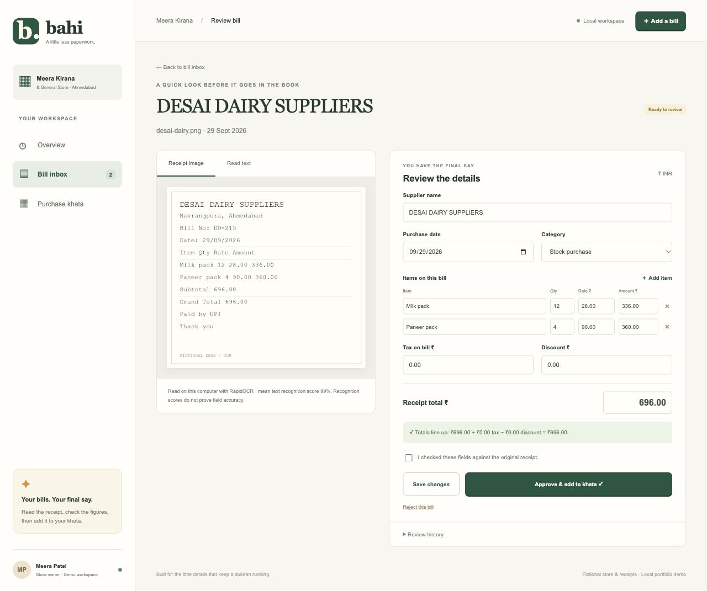
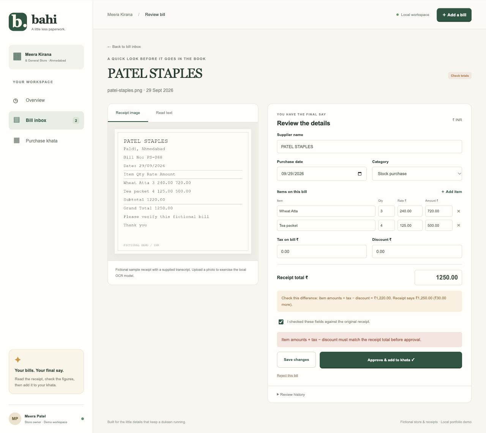
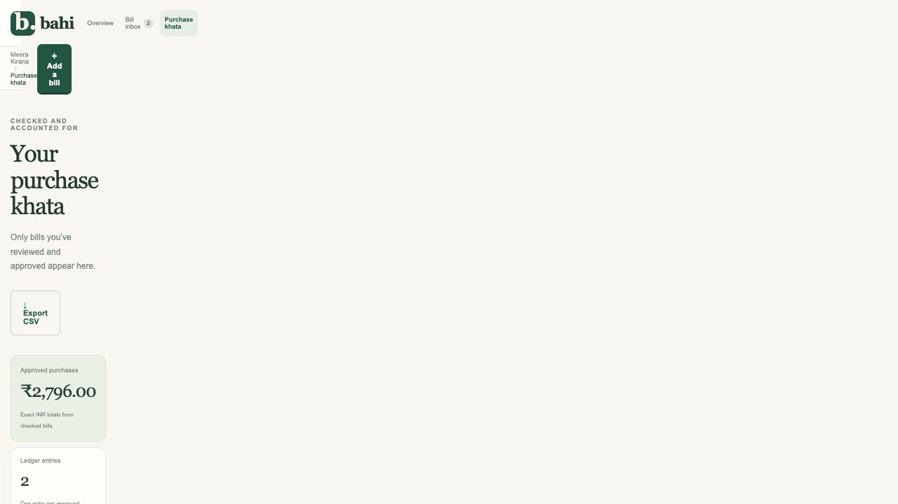
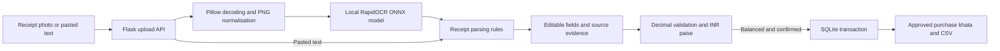

# Bahi Kirana Receipt Desk

[](https://github.com/Siddh-sys-rgb/bahi-kirana-receipt-desk/actions/workflows/tests.yml)

A Flask app that turns supplier receipt images into a reviewed purchase khata for a fictional Ahmedabad kirana store. Upload a bill, inspect the local OCR output, correct the fields, and approve it into a SQLite ledger. A receipt with inconsistent totals cannot be approved.

**Python 3.10–3.12 · Flask · SQLite · RapidOCR and ONNX Runtime · Vanilla JavaScript · No API key**



## What the app does

- Reads PNG, JPEG and WebP receipts using a pretrained OCR model running on your computer.
- Suggests supplier, date, items, tax, discount and total using inspectable parsing rules.
- Shows the original image and recognised text alongside editable fields.
- Checks each quantity × rate and the overall total using exact INR arithmetic.
- Saves review revisions, prevents stale edits, and records a review history.
- Posts one ledger entry per approved receipt, including when approval requests arrive together or are retried.
- Detects duplicate image bytes or duplicate pasted text and links to the existing bill.
- Exports approved purchases as CSV, with spreadsheet formula escaping.

The paper colours, green ledger accents and original book illustration are inspired by Indian dukaan bookkeeping. This is an independent portfolio project with fictional suppliers and names; it is not affiliated with Khatabook.

## Set up locally

Install **64-bit Python 3.10, 3.11 or 3.12**. Python 3.12 is the tested version. Python 3.13+ is outside this dependency set because the pinned NumPy and ONNX Runtime versions have older wheel support. You do not need Node, a GPU, Tesseract, a cloud account or an API key.

Clone the standalone repository first (or download its ZIP):

```bash
git clone https://github.com/Siddh-sys-rgb/bahi-kirana-receipt-desk.git kirana-receipt-desk
cd kirana-receipt-desk
```

From this project's folder on macOS or Linux:

```bash
python3.12 -m venv .venv
source .venv/bin/activate
python -m pip install --upgrade pip
python -m pip install -r requirements.txt -c constraints-tested.txt
python app.py
```

On Windows PowerShell:

```powershell
py -3.12 -m venv .venv
.venv\Scripts\Activate.ps1
python -m pip install --upgrade pip
python -m pip install -r requirements.txt -c constraints-tested.txt
python app.py
```

If PowerShell blocks activation, run `.venv\Scripts\python.exe` in place of `python`; changing your execution policy is unnecessary.

Open **http://127.0.0.1:8104**. Keep the terminal running. Ctrl+C stops the server. The app binds to loopback and starts with three sample bills when its database is empty. Install dependencies while connected to the internet; inference and normal app use then run locally. The pinned RapidOCR wheel includes its model files, so there is no model download on first upload. The first upload loads the model into memory and can take longer.

`requirements.txt` contains the direct dependencies. `constraints-tested.txt` pins the versions installed for validation, including optional test dependencies; constraints do not install those extra packages by themselves. To choose newer compatible dependencies, omit the `-c` option and rerun the tests.

### Separate demo workspaces

Use a new directory to start a fresh demo without removing previous bills:

```bash
python app.py --port 8105 --data-dir instance/fresh-demo
```

Start an empty workspace with no samples:

```bash
python app.py --port 8105 --data-dir instance/my-store --no-demo
```

`--no-demo` only prevents seeding; it does not delete existing receipts. The default database is `instance/bahi.db`, and uploads are in `instance/uploads/`. The local session signing key is in `instance/session.key`. All instance files are ignored by Git. Back up the data directory with the server stopped if you want to retain your work.

## Try a five minute demo

1. Open **Overview**. On a fresh database, Shah Wholesale is approved for ₹2,100, and two bills await review.
2. Open **Patel Staples**. Item amounts sum to ₹1,220 while the printed total is ₹1,250. Check the confirmation box and try approval: the backend blocks the ₹30 mismatch. This sample intentionally contains inconsistent figures. Reject it, or leave it pending for supplier clarification; changing figures without checking their source defeats the review workflow.
3. Click **Add a bill** and select `demo/desai-dairy.png`. This exercises the actual OCR model. Check the extracted date, milk and paneer rows, and ₹696 total against the image.
4. Optionally change the supplier's capitalisation to `Desai Dairy Suppliers` and **Save changes**. Confirm that you checked the receipt, then **Approve & add to khata**.
5. Open **Purchase khata**, inspect the approved entry, and download **Export CSV**.
6. Upload the same image again. The app links to the existing receipt instead of creating another.

Seeded samples use supplied transcripts, explicitly labelled in the interface. Uploads use RapidOCR. Pasted text uses parsing rules only. Uploading a sample image therefore creates a separate receipt from its seeded transcript; the duplicate check compares input bytes/text, not the meaning of two bills. Approve only one representation of a supplier bill.

For a bill without a clear image, choose **Paste bill text** and use this format:

```text
MEERA SUPPLIERS
Date: 30/09/2026
Rice bag 2 450.00 900.00
CGST 22.50
SGST 22.50
Discount 10.00
Grand Total 935.00
```

Items need a name followed by quantity, rate and amount. If an item isn't recognised, add it manually. Supported dates include `DD/MM/YYYY`, `DD-MM-YYYY` and `YYYY-MM-DD`; the review form stores ISO dates.

## Screenshots from the working app

These are browser captures of the locally running Flask app, not mockups. The overview and ledger screenshots show the state after approving an uploaded ₹696 sample, so totals differ from a fresh seed.

### Image extraction and review



### Blocked approval for inconsistent totals



### Approved purchase ledger



The [mobile overview](docs/screenshots/mobile-overview.jpg) was captured at 390 × 844. These relative image links render directly on GitHub; no screenshot hosting service is needed.

## How it works



The learned component is image OCR. Field extraction is deterministic Python code, and approval is a human decision. There is no LLM, embedding database or RAG step in this app. The text recognition score describes OCR output, not the probability that a supplier or total is correct.

| Module | Responsibility |
| --- | --- |
| `app.py` | Local server and workspace CLI |
| `kirana/__init__.py` | Flask API, uploads, CSRF and response handling |
| `kirana/ocr.py` | Local model loading, row grouping and a single inference lock |
| `kirana/parser.py` | Suggested fields, validation and exact INR arithmetic |
| `kirana/db.py` | Receipt storage, revisions, atomic ledger posting and events |
| `kirana/demo.py` | Idempotent fictional sample seeding |
| `kirana/templates/`, `kirana/static/` | Responsive review and ledger interface |
| `demo/` | Original sample images, transcripts and independent field labels |
| `tests/` | API, validation, concurrency, seeding and actual OCR checks |
| `scripts/evaluate_ocr.py` | Repeatable offline acceptance report |

Money becomes integer paise after validation through `Decimal`. Amounts have up to two decimal places and quantities up to three. Quantity × rate uses Decimal's half-even rounding to paise. A difference of **at most one paise** is allowed per item and for the total. `BEGIN IMMEDIATE`, the receipt state check and the unique ledger constraint protect concurrent approvals. Saving requires the current receipt revision, so stale browser tabs receive `409 Conflict` rather than overwriting another review.

## API overview

Call `GET /api/bootstrap` first to receive a session cookie and CSRF token. Mutations need that cookie and `X-CSRF-Token`. The frontend handles this automatically.

| Method and path | Behaviour |
| --- | --- |
| `GET /api/health` | App status and whether the OCR package is installed |
| `GET /api/receipts?status=all` | Receipts and ledger summary; filters include review, approved and rejected |
| `POST /api/receipts` | Multipart `receipt` image, or JSON `{"text":"..."}` |
| `GET /api/receipts/<id>` | Suggested/current fields, checks and extraction evidence |
| `GET /api/receipts/<id>/image` | The normalised PNG or sample receipt image |
| `PUT /api/receipts/<id>` | Save `{"revision":1,"fields":{...}}` |
| `POST /api/receipts/<id>/approve` | Approve with `{"revision":2,"verified":true}` |
| `POST /api/receipts/<id>/reject` | Reject with the current revision |
| `GET /api/receipts/<id>/events` | Extraction, saved review and final decision history |
| `GET /api/ledger` | Approved entries only |
| `GET /api/ledger.csv` | Download approved purchase records |

Validation errors return `422`, stale state/duplicates return `409`, oversized uploads return `413`, and unavailable or busy OCR returns `503`. An identical approval retry returns the existing entry with `created:false`. Approved and rejected bills are closed for edits.

## Test and evaluate

```bash
python -m pip install -r requirements-dev.txt -c constraints-tested.txt
python -m pytest --cov=kirana --cov-report=term-missing
python scripts/evaluate_ocr.py
python -m pip check
```

To isolate the suites:

```bash
python -m pytest -m "not ocr"
python -m pytest -m ocr
```

Tests create temporary databases and files and do not mutate your interactive workspace. The `ocr` tests run the real bundled models against all three images and through the upload API. The evaluation script writes `instance/ocr-evaluation.json` and exits unsuccessfully if any expected field differs.

Local validation: **98 tests passed, 97% Python statement coverage**, including four actual OCR checks. All three authored images matched their independent field labels in the acceptance run. This small set of clean synthetic images does **not** estimate performance on real customer receipts. See [validation details](docs/TESTING.md).

The GitHub Actions workflow checks Python 3.10 and 3.12 on Linux, including real OCR inference and the receipt acceptance evaluation. See [current CI runs](https://github.com/Siddh-sys-rgb/bahi-kirana-receipt-desk/actions/workflows/tests.yml).

## Assumptions and boundaries

- One fictional store and one owner, Meera Patel. There is no login or multi-store isolation. Run locally; public hosting would require authentication and deployment work.
- Printed English INR receipts are the intended input. Gujarati, handwriting, blurry photos, complex tables and uncommon layouts may need manual transcription. Arithmetic checks cannot detect a wrong but internally consistent extraction.
- Images are limited to 5 MB and 8 megapixels; the request limit is 6 MB to allow multipart overhead. Only decoded PNG/JPEG/WebP images are accepted, then re-encoded as PNG. File extensions are not trusted.
- Normal operation makes no outbound OCR requests. Receipts persist unencrypted in the selected local directory. The app does not fetch arbitrary image URLs.
- Duplicate detection covers the same image bytes or trimmed pasted text. Resized photos, alternate scans and a seeded transcript of the same bill are not semantic duplicates.
- This is a purchase khata, with explicit tax/discount amounts from a receipt. Udhaar balances, inventory, GST filing, credit notes and payments are outside the implemented scope.
- The SQLite database and one-at-a-time OCR path target a small local demo. Pagination, OCR job queues, formal schema migrations and immutable external audit storage are future work.

## Troubleshooting

| Symptom | Next step |
| --- | --- |
| Dependency installation cannot find wheels | Check that the interpreter is 64-bit Python 3.10–3.12, then upgrade pip inside the virtual environment. |
| Linux reports `libGL.so.1` missing | The pinned OCR dependency uses OpenCV. Install your distribution's OpenCV runtime libraries, commonly `libgl1` and `libglib2.0-0` on Debian/Ubuntu. |
| Port 8104 is occupied | Use `python app.py --port 8105`. |
| No readable text found | Try a clearer English printed image, or use Paste bill text. |
| Some fields are empty | Fill them from the receipt and add missing item rows before approval. |
| Quantity × rate does not match | Correct quantity, rate and item amount against the source; adding tax does not fix a wrong item row. |
| This bill changed or is closed | Reload and inspect its status/revision. Approved and rejected records cannot be edited. |
| Refresh the page before making changes | Reload to bootstrap a session and CSRF token. |
| Backend edits are not visible | Restart the server and reload; the launcher intentionally disables debug mode. |

## Development history and references

This is a standalone Git repository. The actual commits separate skeleton/dependencies, INR validation and storage, OCR/API, samples, layout, interactions, regression fixes, tests/evaluation, documentation/screenshots, and CI. Commit timestamps reflect the actual work; there is no fabricated development timeline. Private design review notes are held outside this repository and are not part of its commits.

Implementation references: [Flask file uploads](https://flask.palletsprojects.com/en/stable/patterns/fileuploads/), [RapidOCR 1.4.4](https://pypi.org/project/rapidocr-onnxruntime/1.4.4/), and [Python sqlite3 transactions](https://docs.python.org/3/library/sqlite3.html). Source code and authored fixtures use the [MIT license](LICENSE); dependency/model licenses remain their own. No external receipt dataset was used or fine-tuned for this demo.
